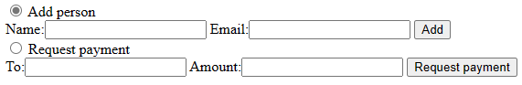
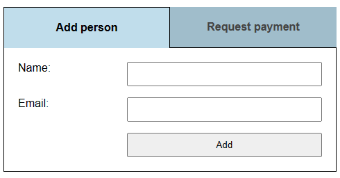

# Challenge 1 - HTML/CSS

- [Challenge 1 - HTML/CSS](#challenge-1---htmlcss)
- [Aim](#aim)
- [HTML overview](#html-overview)
    - [:mag_right: Learning](#mag_right-learning)
    - [:books: Dive deeper](#books-dive-deeper)
    - [:high_brightness: Action](#high_brightness-action)
- [INPUTs](#inputs)
    - [:mag_right: Learning](#mag_right-learning-1)
    - [:books: Dive deeper](#books-dive-deeper-1)
    - [:high_brightness: Action](#high_brightness-action-1)
  - [type="radio"](#typeradio)
- [LABELs](#labels)
    - [:mag_right: Learning](#mag_right-learning-2)
    - [:high_brightness: Action](#high_brightness-action-2)
- [CSS overview](#css-overview)
    - [:mag_right: Learning](#mag_right-learning-3)
    - [:books: Dive deeper](#books-dive-deeper-2)
    - [:high_brightness: Action](#high_brightness-action-3)
- [Class selector](#class-selector)
    - [:mag_right: Learning](#mag_right-learning-4)
    - [:high_brightness: Action](#high_brightness-action-4)
- [Tag selector](#tag-selector)
    - [:mag_right: Learning](#mag_right-learning-5)
    - [:high_brightness: Action](#high_brightness-action-5)
- [Attribute selector](#attribute-selector)
    - [:mag_right: Learning](#mag_right-learning-6)
    - [:high_brightness: Action](#high_brightness-action-6)
- [Child selector](#child-selector)
    - [:mag_right: Learning](#mag_right-learning-7)
    - [:high_brightness: Action](#high_brightness-action-7)
- [Adjacent sibling selector](#adjacent-sibling-selector)
    - [:mag_right: Learning](#mag_right-learning-8)
    - [:high_brightness: Action](#high_brightness-action-8)
- [Pseudo-class selector - :checked](#pseudo-class-selector---checked)
    - [:mag_right: Learning](#mag_right-learning-9)
    - [:high_brightness: Action](#high_brightness-action-9)
- [Pseudo-class selector - :hover](#pseudo-class-selector---hover)
    - [:mag_right: Learning](#mag_right-learning-10)
    - [:high_brightness: Action](#high_brightness-action-10)
- [Flexbox](#flexbox)
    - [:mag_right: Learning](#mag_right-learning-11)
    - [:books: Dive deeper](#books-dive-deeper-3)
    - [:high_brightness: Action](#high_brightness-action-11)
- [CSS Grid](#css-grid)
    - [:mag_right: Learning](#mag_right-learning-12)
    - [:books: Dive deeper](#books-dive-deeper-4)
    - [:high_brightness: Action](#high_brightness-action-12)
- [CSS animation](#css-animation)
    - [:mag_right: Learning](#mag_right-learning-13)
    - [:high_brightness: Action](#high_brightness-action-13)
- [Building tabs](#building-tabs)
    - [:mag_right: Learning](#mag_right-learning-14)
    - [:high_brightness: Action](#high_brightness-action-14)
- [The real deal](#the-real-deal)

# Aim
Looking at Challenge1/index.html, you will see it looks like



By the end of this document, you will have the knowledge to style the tabs and forms to look like 



Each section in this document is designed to give you the building blocks required to style the app. Read through each ### :mag_right: Learning section, then doing the ### :high_brightness: Action section. Some sections might also have a ### :books: Dive deeper block, if at the end you'd like to know more, come back to these sections.

If you get stuck at any point, feel free to ask questions. If you can't get through everything in the workshop, this document is able to be accessed and continued from any internet connected device.

# HTML overview
### :mag_right: Learning

HTML (HyperText Markup Language) is used to structure and give meaning to content on web pages. Below is a simple example of a basic HTML file.
```html
<!doctype html>
<html lang="en">
<head>
  <meta charset="utf-8">
  <title>Hello world</title>
  <meta name="viewport" content="width=device-width, initial-scale=1">
</head>

<body>
  <p>Hello world!</p>
</body>
</html>
```

Tags are the building blocks of HTML files, a tag is defined between the <>, so in the above example we have the following tags: ```html```, ```head```, ```meta```, ```title```, ```body``` & ```p```. Are you able to find each of these tags?

You might notice that many of these tags appear twice, the first like ```<title>``` and the second like ```</title>```, the first one is the opening tag, the second one, with the / is the closing tag. Any text that appears between the opening and closing tags is considered the tags value, in the instance of the ```<title>``` tag, this text will become the title of the page.

Some of the tags in our example also have attributes. Attributes are additional properties assigned to that tag. ```<html lang="en">```, here we open a HTML tag, and add an attribute lang, which we assign the value en. This attribute sets the language of this HTML file. 

### :books: Dive deeper
There are many possible attributes on each html tag, a great resource is [HTML - MDN (Mozilla Developers Network)](https://developer.mozilla.org/en-US/docs/Web/HTML).

### :high_brightness: Action

Continue reading next section.

:heavy_minus_sign: :heavy_minus_sign: :heavy_minus_sign: :heavy_minus_sign: :heavy_minus_sign: :heavy_minus_sign: :heavy_minus_sign: :heavy_minus_sign: :heavy_minus_sign: :heavy_minus_sign: :heavy_minus_sign: :heavy_minus_sign: :heavy_minus_sign: :heavy_minus_sign: :heavy_minus_sign: :heavy_minus_sign: :heavy_minus_sign: :heavy_minus_sign: :heavy_minus_sign: :heavy_minus_sign: :heavy_minus_sign: :heavy_minus_sign: :heavy_minus_sign: :heavy_minus_sign: :heavy_minus_sign: :heavy_minus_sign: :heavy_minus_sign: :heavy_minus_sign: :heavy_minus_sign: :heavy_minus_sign: 

# INPUTs
### :mag_right: Learning

The ```<input>``` HTML tag is an element that has a number of different types, all focused around input from the user in some way.

For the ```<input>``` tag, type is an attribute, here are a few common values for the attribute type
```html
<input type="text" value="test">
<input type="radio" name="question">
<input type="radio" name="question">
<input type="password" value="test">
```

### :books: Dive deeper
[Input - MDN (Mozilla Developers Network)](https://developer.mozilla.org/en-US/docs/Web/HTML/Element/Input).

### :high_brightness: Action

See these in action at https://codepen.io/sacah/pen/RwpQdPN

## type="radio"
In the above example of 2 radio inputs, notice how the name attribute has the same value. This forms a group, and only allows 1 to be selected at a time. If you click on one of the radio inputs above, you'll notice it becomes selected. If you then click on the other radio input, the previous one becomes unselected and the new one becomes selected. This is important behaviour that we can use later.


# LABELs
### :mag_right: Learning

The ```<label>``` HTML tag seems simple, just displaying the text from the tags value. However a LABEL allows you to link this text to an INPUT. You notice in our INPUT examples above, there is nothing to tell you what the field is, the first INPUT is just a text box, how do you know what you should enter?

```html
<label for="firstname">First name</label>
<input type="text" id="firstname">
```

### :high_brightness: Action

See these in action at https://codepen.io/sacah/pen/RwpQdPN

Now with a label, we can identify what information the INPUT wants us to enter. An important behaviour of LABELs is when you click on the label text, you will notice that it directs your focus to the INPUT it is linked with.

# CSS overview
### :mag_right: Learning

CSS (Cascading Style Sheets) is used to define the layout and style of HTML tags. CSS can be entered as the value of a ```<style>``` HTML tag. Here is an example that styles all the text on a page to be blue.
```HTML
<style>
* {
    color: blue;
}
</style>
```

In the example above, ```*``` is the selector, and ```color``` is the property and ```blue``` is the property value. You can have multiple properties per selector, and you can even chain multiple selectors to assign them the same properties.
```CSS
input,
label {
    color: blue;
    font-weight: bold;
    background-color: black;
}
```
In the above example, we've said find any HTML ```input``` or ```label``` tags, and style them so their text color is blue, their text is bold and the background color is black.

### :books: Dive deeper
[CSS - MDN (Mozilla Developers Network)](https://developer.mozilla.org/en-US/docs/Web/CSS).

### :high_brightness: Action

Continuing reading the next section.

# Class selector
### :mag_right: Learning

The most commonly used CSS selector is the Class selector. This allows you to single out 1 or many elements to apply a certain style to them.

You first use the ```class``` attribute on the element, like
```HTML
<div class="full-border">Hello world</div>
```
Now the ```div``` is marked with the class of ```full-border```, in CSS we can style it like
```CSS
.full-border { 
  border: solid red 2px;
}
```
This means any HTML element that has a class attribute containing ```full-border``` will have a big red border applied to it, provided that the HTML element supports borders, some elements don't.

### :high_brightness: Action

See an example you can play with for this and the other selector examples at https://codepen.io/sacah/pen/rNyRmym?editors=1100

# Tag selector
### :mag_right: Learning

As was mentioned above, you can also target HTML tags in CSS. If we have a few ```label``` tags on the page, and want them all to have red borders, we can do this in CSS like
```CSS
label { 
  border: solid red 2px;
}
```
Now all HTML ```label``` tags will have a red border, provided no other style overwrites it.

### :high_brightness: Action

See an example you can play with for this and the other selector examples at https://codepen.io/sacah/pen/rNyRmym?editors=1100

# Attribute selector
### :mag_right: Learning

You can also target attributes defined on HTML tags, with the following HTML code
```HTML
<input type="text">
```
You could target any ```input``` tag with ```type="text"``` via CSS like
```CSS
input[type="text"] {
  border: solid red 2px;
}
```

### :high_brightness: Action

See an example you can play with for this and the other selector examples at https://codepen.io/sacah/pen/rNyRmym?editors=1100

# Child selector
### :mag_right: Learning

A child refers to a HTML tag that is nested directly inside another HTML tag, so in this example the ```input``` is the child of the ```div```
```HTML
<div>
  <input>
</div>
```

It does not include children nested within children though, think of them as grandchildren. In this example, only the ```span``` is a child of ```div```, ```input``` is a child of ```span```, and a grandchild of ```div```.
```HTML
<div>
  <span>
    <input>
  </span>
</div>
```

In CSS, we can target children like this
```CSS
div > span {
  border: solid red 2px;
}
```

This will make any ```span``` that is a child off a ```div``` have a red border.

### :high_brightness: Action

See an example you can play with for this and the other selector examples at https://codepen.io/sacah/pen/rNyRmym?editors=1100

# Adjacent sibling selector
### :mag_right: Learning
A sibling refers to a HTML tag that has the same parent, an adjacent sibling is a HTML tag that also immediately follows the reference element.

In this example, ```input``` is an adjacent sibling of ```label```
```HTML
<div>
  <label>Name</label>
  <input>
</div>
```

We can target this in CSS like
```CSS
label + input {
  border: solid red 2px;
}
```

### :high_brightness: Action

See an example you can play with for this and the other selector examples at https://codepen.io/sacah/pen/rNyRmym?editors=1100

# Pseudo-class selector - :checked
### :mag_right: Learning

Pseudo-classes are set based on the elements state. Inputs with a ```type``` of radio, or checkbox, will have a ```:checked``` pseudo-class applied to it when it is selected. Radios and Checkboxes can't have a border applied to them though, so lets use the pseudo-class in combination with a sibling selector to add a border to a label.
```HTML
<input type="radio" name="rgroup" id="radio1">
<label for="radio1">Radio 1</label>
<input type="radio" name="rgroup" id="radio2">
<label for="radio2">Radio 2</label>
```
And CSS
```CSS
input:checked + label {
  border: solid red 2px;
}
```

### :high_brightness: Action

See an example you can play with for this and the other selector examples at https://codepen.io/sacah/pen/rNyRmym?editors=1100

# Pseudo-class selector - :hover
### :mag_right: Learning

If your mouse is over an element, it will have a ```:hover``` pseudo-class applied to it.
```HTML
<span>Hello</span>
<span>World</span>
```
And CSS
```CSS
span:hover {
  border: solid red 2px;
}
```

### :high_brightness: Action

See an example you can play with for this and the other selector examples at https://codepen.io/sacah/pen/rNyRmym?editors=1100

# Flexbox
### :mag_right: Learning

Flexbox is a one dimensional layout model, allowing you to specify things in either a row or column, compared to something like CSS Grid, which we'll cover later, which is a two dimensional model, as you can do rows and columns at the same time.

### :books: Dive deeper
Flexbox is hugely capable, we've only covered a very small amount of it's capabilities. If you'd like to learn more about it, here is a great page https://css-tricks.com/snippets/css/a-guide-to-flexbox/

### :high_brightness: Action

Head over to https://codepen.io/sacah/pen/YzVQYwZ?editors=1100 and follow the instructions to learn the basics of Flexbox.

# CSS Grid
### :mag_right: Learning

We just talked about Flexbox, which is a one dimensional layout model, now CSS Grids are a two dimensional layout model, as you can define both rows and columns at the same time. This allows you to make quite complex layouts.

### :books: Dive deeper
CSS Grid is also hugely capable, to dive in deeper, a great page is https://css-tricks.com/snippets/css/complete-guide-grid/
And https://developer.mozilla.org/en-US/docs/Web/CSS/CSS_Grid_Layout

### :high_brightness: Action

Head over to https://codepen.io/sacah/pen/qBmXyaQ?editors=1100 and follow the instructions to learn the basics of CSS Grid.

# CSS animation
### :mag_right: Learning

Another very powerful concept, animations can give a more intuitive user interface and more efficient that old methods of animation, like using GIFs, or JavaScript animation.

At the core, you define a named keyframe
```CSS
@keyframes rainbow {
  0%, 100% {
    background-color: red;
  }
  16% {
    background-color: orange;
  }
  30% {
    background-color: yellow;
  }
  44% {
    background-color: green;
  }
  58% {
    background-color: blue;
  }
  72% {
    background-color: indigo;
  }
  86% {
    background-color: violet;
  }
}
```

This says at 0% and 100% it should be red. At 16%, it should be orange and so on.

CSS animations then figured out how to animate from 0% to 16%, so it will slowly change from red to orange, based on the timeframe we specify.

Then we apply the defined animation to an element.

```CSS
.box { 
  animation: rainbow 5s infinite;
}
```

We use the animation property, rainbow is the name of the above keyframes we defined. 5s refers to it taking 5 seconds to go from 0% to 100%, allowing you to control the speed of the animation. infinite says this animation should run on a loop.

To dive deeper, check out https://developer.mozilla.org/en-US/docs/Web/CSS/animation

### :high_brightness: Action

You can see it running at https://codepen.io/sacah/pen/VwbzEzX?editors=1100

The beauty of animation is that you can define any CSS property in each keyframe and it will figure out how to gradually change from one to the other value, maybe you want to increase the width of an element, maybe change its position on the page, the possibilities are endless.

# Building tabs
### :mag_right: Learning

Everyone should be familiar with the concept of tabs, here we will use ```label``` and ```input type="radio"``` to create easy to use accessible tabs.

Accessibility is important, as not everyone on the internet accesses their device in the same way. While there are many different ways we could make tabs that look and work the same way to sighted users with a mouse, enabling them to work for people not using a mouse, or people with visual impairments using a screen reader.

This method we're using is the simplest, and most accessible option.

### :high_brightness: Action

Head over to https://codepen.io/sacah/pen/dyWzgrq?editors=1100 and follow the instructions to learn about creating Tabs with labels and radios.

# The real deal
Now you have learnt all the building blocks you need to style the tabs and form to look like

